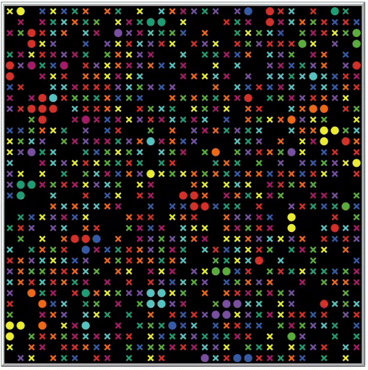
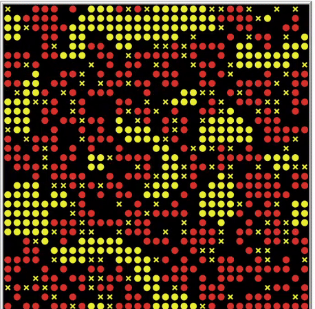
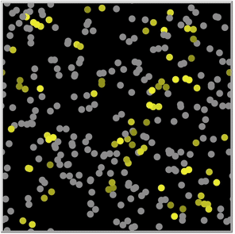
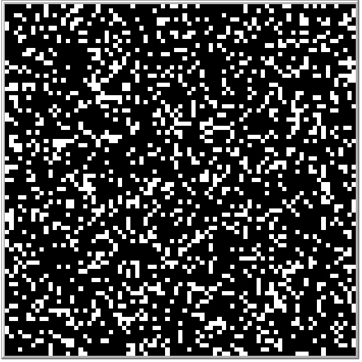
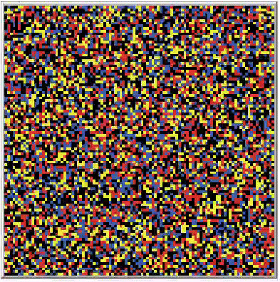
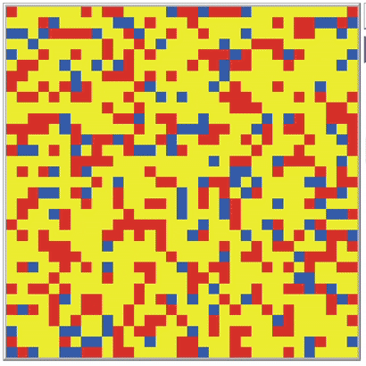

# PROYECTO 1

Este repositorio reúne mis prácticas del curso **Proyecto I** de la Facultad de Ciencias de la UNAM, impartido por el **Biol. Luis Guillermo García Jácome**. A lo largo del semestre exploramos, con ayuda de **NetLogo**, cómo reglas simples a nivel local pueden dar lugar a comportamientos sorprendentes y complejos a nivel global.

Uno de los momentos más significativos para mí fue descubrir el **poder del modelado basado en agentes (MBA)**. Creo firmemente que es una herramienta poderosa para representar sistemas complejos, dinámicas sociales, ecológicas y patrones emergentes.

## 🎞️ Visualización de simulaciones
A continuación, una galería visual con algunos de los modelos desarrollados durante el curso:

<table>
  <tr>
    <td align="center"> <b>Schelling: múltiples grupos</b></td>
    <td align="center"> <b>Schelling: distintas preferencias</b></td>
    <td align="center"> <b>Sincronización de luciérnagas</b></td>
    <td align="center"> <b>Juego de la vida</b></td>
  </tr>
    <td align="center"> <b>Hormiga de Langton</b></td>
    <td align="center"> <b>Modelo de arena</b></td>
    <td align="center"> <b>Competencia local/global</b></td>
    <td align="center"> <b>Competencia + eventos</b></td>
    <td></td>
  </tr>
</table>
